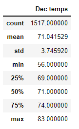

# Surfs Up!
## Overview of the Analysis:
The purpose of this analysis is to help W.Avy get the temperature trends before he opens his surf shop. 
He wants to know the temperature data for the months of June and December in Oahu to make important decisions on his suft and ice cream shop businesses.

## Results: 
* 3 key differences in weather between June and December 
 * There is not much difference in the lowest temperature.
 * There is not much difference in the highest temperature.
 * There is not much difference in the average temperature.

Let me show you the statistics: 

 * The Statistics for the month of June:
  * The average temperature would be 74.9 °F and the highest temperature would be 85 °F. 
  
   

* The Statistics for the month of December:
  * The average temperature would be 71 °F and the highest temperature would be 83 °F. 
  
   
